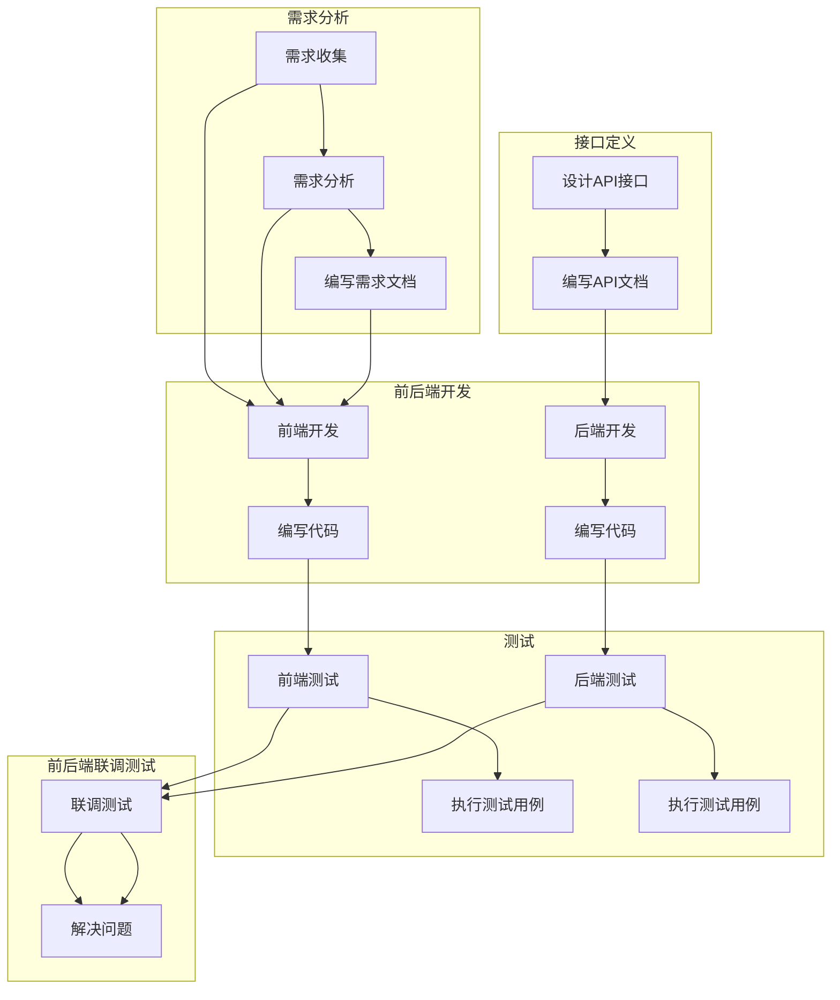

# HTML5 And CSS3

---

## CSS 盒子模型

  

## Table 标签

  

## JS 常见事件

  

## Vue框架

1. v-text
语法

```html
<span v-text="message"></span>
```

注意点
用于更新元素的文本内容。
替代插值语法 `{{ message }}`，避免 XSS 攻击。

2. v-on
语法

```html
<button v-on:click="handleClick">Click me</button>
```

注意点
用于监听 DOM 事件。
也可以缩写为 @，如 @click="handleClick"。
3. v-html
语法

```html  
<div v-html="rawHtml"></div>
```

注意点
用于更新元素的 HTML 内容。
慎用，避免 XSS 攻击。
4. v-bind
语法

```html
 
```

注意点
用于动态绑定属性。
也可以缩写为 :src="imageUrl"`。
5. v-if
语法

```html
<div v-if="isVisible">Content</div>
```

注意点
根据条件判断是否渲染元素。
可与 `v-else` 和 `v-else-if` 搭配使用。
6. v-show
语法

```html
<div v-show="isVisible">Content</div>
```

注意点
根据条件控制元素的显示与隐藏。
始终渲染，通过 CSS 的 display 属性控制。
7. v-for
语法

```html
<ul>
    <li v-for="(item, index) in items" :key="index">
        {{ item.text }}
    </li>
</ul>
```

注意点
用于循环渲染列表。
可以使用 of 替代 in。
8. v-model
语法

```html
<input v-model="message"> 
```

注意点
用于实现表单元素与数据的双向绑定。
适用于输入框、复选框、单选框等表单元素。

### vue3的简单结构

```javascript
<!DOCTYPE html>
<html lang="en">
  <head>
    <meta charset="UTF-8">
    <meta name="viewport" content="width=device-width, initial-scale=1.0">
    <title>test</title>
    <link rel="icon" href="data:;base64,iVBORw0KGgo=">
  </head>
  <body>
    <div id="app">
        
    </div>

    <script type="module">
      import { createApp, ref } from "https://cdn.jsdelivr.net/npm/vue@3/dist/vue.esm-browser.js";
      const app = Vue.createApp({
          setup() {
              
              return {
                  
              };
          }
      });
      app.mount("#app");
    </script>
  </body>
</html>
```

## vue生命周期

- 生命周期：一个对象从创建到销毁的整个过程
- 每触发一个生命周期事件，会自动执行一个生命周期方法（钩子）

  

`vue2`

  

`vue3`

```javascript
const app = createApp({
            setup() {
                // 在 setup 函数中使用 onMounted 替代 mounted
                onMounted(() => {
                    console.log("挂载完成");
                });

                // 在 setup 函数中使用 onBeforeUpdate 替代 beforeUpdate
                onBeforeUpdate(() => {
                    console.log("更新前");
                });

                // 在 setup 函数中使用 onUpdated 替代 updated
                onUpdated(() => {
                    console.log("更新中");
                });

                // 在 setup 函数中使用 onBeforeUnmount 替代 beforeDestroy
                onBeforeUnmount(() => {
                    console.log("销毁前");
                });

                // 在 setup 函数中使用 onUnmounted 替代 destroyed
                onUnmounted(() => {
                    console.log("销毁后");
                });

                return {};
            },
        });
        app.mount("#app");
```

## 网络应用

### **axios**

```javascript
// 相比.then()/.catch()的方式，async/await的方式
// 可读性更强，错误处理更方便，保证顺序执行，拥有更好的错误栈
const getData = async () => {
    try {
        const response = await axios.get(`url`);
        // 实际操作
    } catch (error) {
        // 异常处理
        console.log(error);
    }
};
```


## 前端工程化

    在企业级的前端项目开发中，把前端开发所需的工具、技术、流程、经验等进行规范化、标准化

1. 需求分析
2. 接口定义（api接口文档）
3. 前后端开发
4. 测试（前端，后端）
5. 前后端联调测试




采用`yapi`接口管理平台